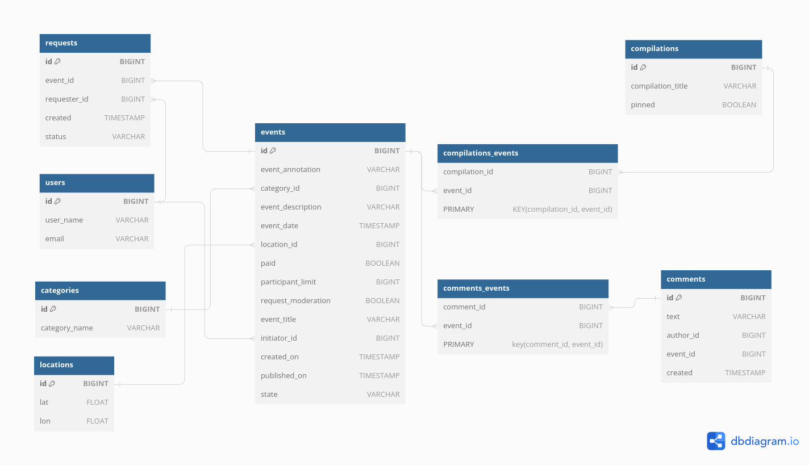
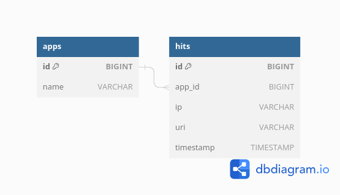

Ссылка на Pull Request:

https://github.com/alisilakg/java-explore-with-me/pull/5

# java-explore-with-me
Template repository for ExploreWithMe project.
## Основной сервис
### Дополнительная функциональность
#### _ЗАДАЧА_
- Возможность для пользователей добавлять комментарии к событиям.
- Просмотр всех своих комментариев.
- Осуществление поиска по коменнтариям.
#### _ЛОГИКА_
> Добавление комментария:

- При добавлении комментария пользователь указывает текст комментария и id события.
- Есть возможность изменить комментарий автором.
- Есть возможность удалить комментарий автором.

> Получение списка всех своих комментариев

- получение по id пользователя, переданному через переменную пути
- from / size — для постраничного вывода.

> Поиск по комментариям события

Поиск осуществляется по следующим параметрам:
- список пользователей,
- текст комментария,
- диапазон дат.

Параметры для поиска передаются в виде параметров запроса.

### ER-диаграмма

### Описание БД

#### events
Содержит данные о событиях

**Поля:**
* первичный ключ id — идентификатор записи;
* annotation — аннотация события
* category_id — id категории
* description — описание события
* event_date — дата события
* location_id — id локации
* paid — платное или нет
* participant_limit — ограничение на кол-во участников (если 0 — без ограничения)
* request_moderation — требуется ли подтверждение заявок, по умолчанию - нет
* title — заголовок события
* initiator — id организатора события
* created_on — дата создания события
* published_on — дата публикации
* state — состояние события (ждет модерации, отменено, опубликовано)

#### users
Содержит данные о пользователях.

**Поля:**
* первичный ключ id — идентификатор записи;
* name — уникальное имя пользователя
* email — уникальный email

#### categories
Содержит данные о категориях.

**Поля:**
* первичный ключ id — идентификатор записи;
* name — уникальное название категории

#### locations
Содержит данные о локациях.

**Поля:**
* первичный ключ id — идентификатор записи;
* lat — широта
* lon — долгота

#### requests
Содержит данные о заявках на участие в событиях.

**Поля:**
* первичный ключ id — идентификатор записи;
* event_id — id события
* requester_id — id пользователя, который отправил заявку
* created — дата создания заявки
* status — статус заявки (ждет модерации, отклонена, отменена, подтверждена)

#### compilations
Содержит данные о подборках.

**Поля:**
* первичный ключ id — идентификатор записи;
* title — уникальное название подборки
* pinned — закреплена ли подборка на главной странице

#### compilations_events
Вспомогательная таблица многие-ко многим.
Содержит данные о связи подборок и событий.

**Поля:**
* compilation_id — id подборки
* event_id — id события

#### comments
Содержит данные о подборках.

**Поля:**
* первичный ключ id — идентификатор записи;
* text — уникальное название подборки
* author_id - автор комментария
* event_id — закреплена ли подборка на главной странице
* created - дата создания комментария

#### comments_events
Вспомогательная таблица многие-ко многим.
Содержит данные о связи подборок и событий.

**Поля:**
* comment_id — id подборки
* event_id — id события

## _Сервис статистики_
### ER-диаграмма

### Описание БД

#### apps
Содержит данные о названиях сервисов.

**Поля:**
* первичный ключ id — идентификатор записи;
* name — название сервиса для которого записывается информация

#### hits
Содержит данные о просмотрах.

**Поля:**
* первичный ключ id — идентификатор записи;
* app_id — идентификатор названия сервиса
* ip — IP-адрес пользователя, осуществившего запрос
* uri - uri
* timestamp — дата и время запроса

